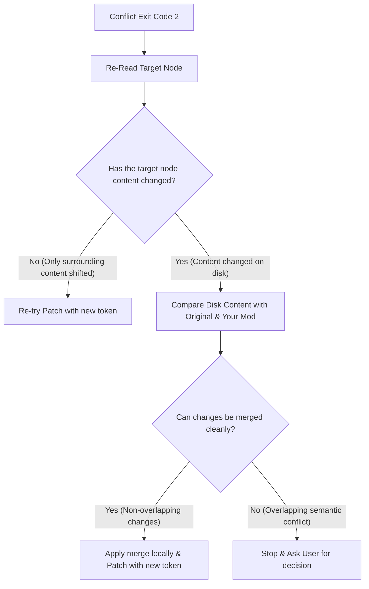

# Conflict Resolution & Merge Guide

When modifying a Markdown file, the CLI may return exit code `2` with `TARGET_CHANGED` or `DOCUMENT_CHANGED`. This means a concurrent edit was made to the target section or file since you last read it. 

Follow this protocol to resolve the conflict automatically or ask the user.

---

## 🔄 Automated Recovery Flow

Do not immediately fail or throw an error. Try to resolve the conflict using this algorithm:



### Step 1: Re-Read the Node
Run `read` again to obtain the latest content on disk and a fresh `anchor_token`.

### Step 2: Compare States
You now have three versions of the target node content:
1. **Original ($O$)**: The content you read initially.
2. **Current Disk ($D$)**: The new content currently on disk (modified by someone else).
3. **Your Modification ($M$)**: The content you planned to write.

Compare $D$ and $O$. If $D == O$, then the target itself did not change (only the file version or surrounding lines changed). You can immediately retry `patch` using the new `anchor_token`.

### Step 3: Perform 3-Way Merge
If $D \neq O$, check if your changes in $M$ conflict with the changes in $D$:
* **Case A (Non-overlapping)**: The concurrent change edited a different line or key-value pair in the node than your change. 
  * *Action*: Merge the changes. Create a merged version $M'$ that contains both edits. Apply `patch` with $M'$ and the new `anchor_token`.
* **Case B (Overlapping/Semantic Conflict)**: Both changes edited the exact same line, GFM table cell, or list item.
  * *Action*: Stop. Do not attempt to merge. Report the conflict to the user.

---

## 💬 User Conflict Report Template

If you hit Case B (overlapping semantic conflict), output a clear, structured message to the user:

```markdown
⚠️ **MD SafeEdit: Concurrent Edit Conflict**

I attempted to update a section in `[filename]`, but it was modified by someone else since I last read it.

* **Original state**:
  [show Original content]
* **Current state on disk**:
  [show Current Disk content]
* **My planned change**:
  [show Your Modification]

**How would you like to proceed?**
1. Overwrite with my change (force update).
2. Keep the current disk version and discard my edit.
3. Help me resolve and merge them manually.
```
