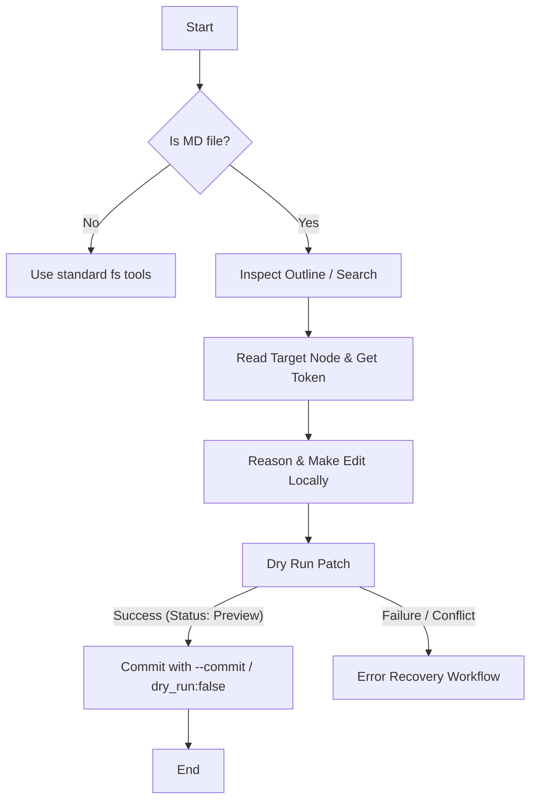

# MD SafeEdit Core Workflow

This document details the standard operation sequence for reading and mutating Markdown files using MD SafeEdit.

## Workflow Sequence

Agents MUST always follow this sequential execution protocol when reading or modifying Markdown documents:



### Step 1: Inspect or Search (Locate Target ID)
Never read the entire file if you only need to modify a small portion. First, inspect the document layout to find the logical block runtime ID:
- **Using CLI**:
  ```bash
  npx mdse inspect path/to/file.md --json
  ```
- **Using MCP**:
  Call the `inspect` tool with the file path.

If looking for specific text:
- **Using CLI**:
  ```bash
  npx mdse search path/to/file.md "search query" --json
  ```
- **Using MCP**:
  Call the `search` tool with the file path and query.

### Step 2: Read the Node (Acquire Anchor Token)
Read the exact node you want to modify to get the content and the signed anchor token.
- **Using CLI**:
  ```bash
  npx mdse read path/to/file.md "section_runtime_id" --json
  ```
- **Using MCP**:
  Call the `read` tool with the runtime ID.

### Step 3: Modify & Dry-run (Preview Changes)
Compute the edits in memory, then execute a **dry-run** patch to verify there are no overlaps or structural violations:
- **Using CLI**:
  ```bash
  npx mdse patch path/to/file.md replace "anchor_token" "New content string" --json
  ```
- **Using MCP**:
  Call the `patch` tool with `dry_run: true`.

### Step 4: Commit
Once the dry-run diff is verified, execute the write:
- **Using CLI**:
  ```bash
  npx mdse patch path/to/file.md replace "anchor_token" "New content string" --commit --json
  ```
- **Using MCP**:
  Call the `patch` tool with `dry_run: false`.
