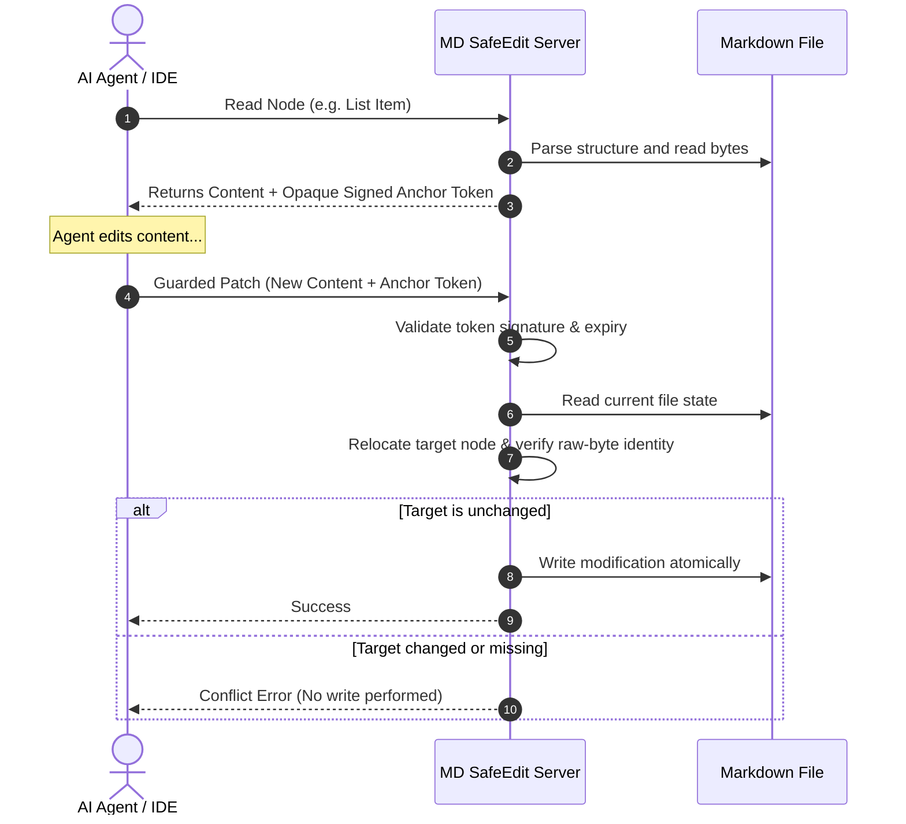

# MD SafeEdit

> **Safe, precise, structure-aware Markdown editing for AI coding agents.**

MD SafeEdit is a Markdown editing tool **distributed via Agent Skills** and **executed by a CLI safety engine**, with an optional **MCP adapter** for structured environments, and a **Node.js Library** for integration. It protects files from silent overwrites, handles content relocation when surrounding lines move, and ensures byte-for-byte fidelity of untouched parts.

---

## 📦 Distribution Hierarchy & Architecture

MD SafeEdit is structured to support different workflows depending on your agent integration environment:

1. **Skill (Discovery & Workflow)**: The primary entry point. Instructs the Agent on how to find and coordinate the edit cycle without modifying raw markdown.
2. **CLI (Local Execution)**: The default, omnipresent execution backend. Can be run on-demand via `npx` with **zero system clutter** or installed globally.
3. **Node.js Library (Integration)**: For direct programmatic usage in developer codebases.
4. **MCP (Structured Adapter)**: An optional interface for clients like Cursor or Claude Desktop requiring tool-level JSON Schema controls.

---

## 🚀 Getting Started

Choose the path that best fits your environment.

### 1. Install the Agent Skill (Recommended for AI Agents)

To guide your programming Agent (e.g., Codex, Claude Code, Aider, etc.) to use MD SafeEdit, place the Skill configuration folder into your workspace customizations root:

* Folder Path: `.agents/skills/md-safeedit/`
* Files: [SKILL.md](.agents/skills/md-safeedit/SKILL.md) and [references/conflict-resolution.md](.agents/skills/md-safeedit/references/conflict-resolution.md)

Once loaded, the Agent will automatically discover the tool and execute CLI commands on-demand via `npx` with zero permanent installation footprint.

---

### 2. Use via Command Line (CLI)

You can run the CLI on-demand via `npx` without cluttering your system, or install it globally:

#### A. Run On-Demand via `npx` (No Global Install)
```bash
# Inspect file outline
npx -y @md-safeedit/cli@dev inspect path/to/document.md

# Search for nodes
npx -y @md-safeedit/cli@dev search path/to/document.md "query"

# Read target node
npx -y @md-safeedit/cli@dev read path/to/document.md "node_id_here"

# Patch target node (preview dry-run)
npx -y @md-safeedit/cli@dev patch path/to/document.md replace "anchor_token" "New content"

# Commit patch to disk
npx -y @md-safeedit/cli@dev patch path/to/document.md replace "anchor_token" "New content" --commit
```

#### B. Install Globally
```bash
npm install -g @md-safeedit/cli@dev

# Use the 'mdse' binary directly
mdse inspect path/to/document.md
```

> [!NOTE]
> During the developer preview phase, all packages are published with the `@dev` tag. Ensure you append `@dev` when installing or calling via `npx`.

---

### 3. Use as a Node.js / TypeScript Library

If you are building your own Agent or document processing pipeline, import the libraries directly:

```bash
npm install @md-safeedit/core@dev @md-safeedit/markdown@dev
```

```typescript
import { createSnapshot } from '@md-safeedit/core';
import { parseMarkdownToNodes, buildLogicalSections } from '@md-safeedit/markdown';

// Perform AST parsing, snapshotting, and transaction planning programmatically.
```

---

### 4. Run as an MCP Server (Optional Adapter)

For environments like Claude Desktop or Cursor that lack a shell but support Model Context Protocol (MCP):

#### Claude Desktop Configuration
Add this to your configuration file (typically `claude_desktop_config.json`):

```json
{
  "mcpServers": {
    "md-safeedit": {
      "command": "npx",
      "args": [
        "-y",
        "@md-safeedit/mcp@dev"
      ],
      "env": {
        "MDSE_ALLOWED_ROOTS": "/absolute/path/to/your/workspace"
      }
    }
  }
}
```

#### Cursor Configuration
1. Go to **Settings** -> **Features** -> **MCP**.
2. Click **+ Add New MCP Server**.
3. Set the details:
   - **Name**: `md-safeedit`
   - **Type**: `stdio`
   - **Command**: `npx -y @md-safeedit/mcp@dev`
4. *(Optional)* Add the `MDSE_ALLOWED_ROOTS` environment variable in Cursor's settings. By default, it will allow operations in Cursor's current working directory.

---

## 💡 How It Works & Example

Traditional editing tools (e.g., regex replacement, unified diffs, full-file rewrites) often suffer from **ambiguity** (duplicate text in a file) or **stale writes** (writing to a file that has changed since the agent last read it). 

MD SafeEdit uses a **Compare-and-Swap (CAS) signature-guarded protocol**:



### Protocol Example

1. **Agent reads a node** (e.g., a table row):
   ```json
   {
     "content": "| Charging current | 1A |",
     "anchor": {
       "token": "mdse_a1_..."
     }
   }
   ```
2. **Agent requests a guarded patch**:
   ```json
   {
     "operations": [
       {
         "op": "replace",
         "anchor_token": "mdse_a1_...",
         "content": "| Charging current | 2A |"
       }
     ]
   }
   ```
3. **MD SafeEdit applies the patch**:
   - Verify that the target node is unmodified (raw-byte identity).
   - Relocate the node if surrounding lines changed but the target itself is unchanged.
   - Refuse the write with a descriptive error code (e.g. `TARGET_CHANGED`) if anyone else changed the target.

---

## ⚖️ Benchmark & Performance Results

We evaluated the core protocol against 4 common baseline strategies across **200 programmatic tasks** (testing safety, concurrency conflicts, and relocation) and a **synthetic token scaling simulation** (measuring token efficiency).

### 1. Safety & Correctness (200 Tasks)

| Editing Strategy | Safe Edit Success Rate (SESR) | False Accept Rate (FAR) | Key Limitations |
| :--- | :---: | :---: | :--- |
| **B1 (Full-File Rewrite)** | 64.3% | **100.0%** | Overwrites concurrent human or agent edits silently. |
| **B2 (Exact String Replace)** | 70.7% | **0.0%** | Fails completely on duplicate strings (ambiguity). |
| **B3 (Unified Diff)** | 77.9% | **33.3%** | Prone to fuzzy-matching corruption in similar sections. |
| **B4 (Line-Hash Patch)** | 74.3% | **0.0%** | Fails on shifted offsets if lines before/after are added. |
| **B5 (MD SafeEdit)** | **99.3%** | **0.0%** | **Achieved 0% FAR and 0% wrong-target writes in the project’s 200-task synthetic benchmark.** |

* **Safe Edit Success Rate (SESR)**: The ratio of successfully applied patches to total valid patch requests. A valid patch request is one where the target node exists and is structurally identical to the original token's state, but may have shifted in position due to concurrent modifications in other parts of the document.
* **False Accept Rate (FAR)**: The ratio of incorrectly allowed edits (silent overwrites) to total conflict/tamper test cases. A false acceptance occurs when a patch is committed despite the target node having been deleted/modified, or when the token has been tampered with or expired. FAR must remain strictly **0.0%** to guarantee edit safety.

### 2. Token Efficiency (Synthetic Token Scaling Estimate)

To verify how token consumption scales with file size, we simulated editing a single table row across three realistic document sizes (estimating tokens as `characters / 4`):

| Document Size | B1: Full-File Rewrite (In / Out / Total) | B3: Unified Diff (In / Out / Total) | B5: MD SafeEdit (In / Out / Total) | MD SafeEdit Savings vs B1 | MD SafeEdit Savings vs B3 |
| :--- | :---: | :---: | :---: | :---: | :---: |
| **2KB** (Readme) | 582 / 582 / **1,164** | 582 / 72 / **654** | 175 / 30 / **205** | **82.4%** | **68.7%** |
| **10KB** (Tech Spec) | 2,579 / 2,579 / **5,158** | 2,579 / 72 / **2,651** | 475 / 30 / **505** | **90.2%** | **81.0%** |
| **50KB** (API Spec) | 12,884 / 12,884 / **25,768** | 12,884 / 72 / **12,956** | 1,955 / 30 / **1,985** | **92.3%** | **84.7%** |

* **B1 (Full Rewrite)** scales linearly for both input and output.
* **B3 (Unified Diff)** reduces output tokens but still reads the entire file (linear input scale).
* **B5 (MD SafeEdit)** keeps token counts flat. Only the structural outline headers (which grow slowly and remain independent of content size) and the target node are processed, achieving **80% to 92%+ token savings** on typical documents.

See the complete [Benchmark Report](packages/benchmark/REPORT.md) for full task breakdowns.

---

## ⚙️ Configuration (Environment Variables)

Customize the behavior of the MCP server or CLI using the following environment variables:

| Variable | Default | Description |
| :--- | :--- | :--- |
| `MDSE_ALLOWED_ROOTS` | `process.cwd()` | Comma-separated list of absolute paths. Prevents directory traversal attacks; the server will reject reads or writes outside these directories. |
| `MDSE_TOKEN_TTL_MS` | `3600000` (1 hour) | Lifetime of signed anchor tokens in milliseconds. Prevents agents from using stale tokens from hours or days ago. |

---

## 🛠️ Contributor & Developer Guide

If you want to modify the source code, build locally, run tests, or execute the benchmarks:

### Prerequisites
- Node.js LTS
- npm

### 1. Clone & Build
```bash
git clone https://github.com/Igloo302/md-safeedit.git
cd md-safeedit
npm install
npm run build --workspaces
```

### 2. Run Tests
```bash
npm run test
```

### 3. Run the Benchmark Suite
```bash
# Generate the 200 tasks
node packages/benchmark/dist/generate-tasks.js

# Execute the runner and output comparison
node packages/benchmark/dist/run.js
```

---

## 📦 Monorepo Packages

MD SafeEdit enforces strict package boundaries:

* [`packages/core`](packages/core): Guarded patch engine (revisions, CAS planning, atomic CAS writer, overlap detection). **No Markdown dependency.**
* [`packages/markdown`](packages/markdown): Markdown structural adapter (parsing, outline, relocation, dialect validation).
* [`packages/protocol`](packages/protocol): Public request/response schemas and HMAC-signed anchor tokens.
* [`packages/cli`](packages/cli): Command Line Interface (JSON-RPC adapter).
* [`packages/mcp`](packages/mcp): Model Context Protocol (MCP) server for stdio.
* [`packages/benchmark`](packages/benchmark): Benchmarking suite and baseline implementations.

---

## 🛡️ Safety Invariants & Scope

For a detailed analysis of our safety design and threat model, see the [Security Model](docs/security-model.md). For detailed constraints and unsupported features, see [Known Limitations](docs/known-limitations.md).

### Safety Invariants
- A write operation must not accept a bare node ID; it **must** carry an opaque anchor token.
- Normalized hashes are used for ranking, but only **raw-byte identity** authorizes automatic relocation.
- Any intersecting mutation ranges in one transaction reject the entire transaction.
- Validation and disk-state verification happen again immediately before commit.
- Untouched byte ranges remain byte-for-byte identical (no line ending normalization).

### Supported Structures (Phase 1)
- Document, ATX and Setext headings, logical sections.
- Paragraphs, list items, fenced code blocks, GFM tables and table rows.
- YAML frontmatter as a raw top-level block.

---

## 📄 License

Licensed under the Apache License, Version 2.0. See [LICENSE](LICENSE) for details.
