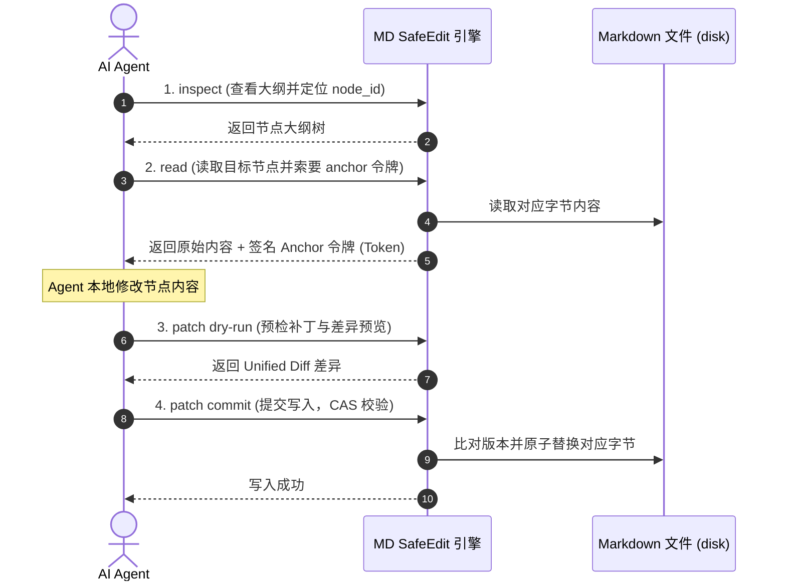

# MD SafeEdit

> **为 AI 编程 Agent 打造的结构感知、安全可靠的 Markdown 协同编辑引擎。**

MD SafeEdit 是一套专为 AI Agent（如 Cursor、Claude Code、Aider 等）和开发工作流设计的 Markdown 安全编辑工具。它采用**基于 CAS（Compare-and-Swap）签名保护的协议**，从根本上防止 Agent 在修改 Markdown 文件时发生静默覆盖、定位偏差及内容损毁。

[](https://www.npmjs.com/package/@md-safeedit/cli)
[](https://github.com/Igloo302/md-safeedit)
[](LICENSE)

---

## 🎯 一句话价值说明

**防止 Agent 在协同场景下对 Markdown 进行静默覆盖与错误定位，保证未修改内容字节级不变，并比全文覆写节省高达 90% 以上的 Token 消耗。**

---

## 📦 安装 Agent Skill

MD SafeEdit 的核心定位是作为 **Agent Skill** 注入到 Agent 的工作上下文中。

### 1. Skill 目录结构

将项目中的 `.agents/skills/md-safeedit` 文件夹复制到您项目工作区的定制化技能目录下（例如 `.agents/skills/md-safeedit/`）：

```text
.agents/
└── skills/
    └── md-safeedit/
        ├── SKILL.md                 # 核心 Agent 指导指令
        ├── scripts/
        │   └── md-safeedit          # 辅助工具脚本
        └── references/
            ├── workflow.md          # 协同工作流定义
            ├── error-recovery.md    # 错误恢复与冲突处理机制
            └── supported-markdown.md # 支持的 Markdown AST 节点类型
```

### 2. 自动发现与执行

一旦 Skill 被载入，Agent 将会在需要修改 Markdown 文件时自动触发该 Skill 的安全工作流，并通过 `npx` 免安装按需调用 CLI 引擎，实现零环境污染、零侵入性部署。

---

## 💡 典型使用示例

### 1. 快速演示（正常修改流）

AI Agent 在修改 Markdown 文档（如 `docs/spec.md`）中的某个列表项时，会遵循以下四步：



### 2. 冲突恢复案例（Stale Write 恢复演示）

当两个 Agent（或人类与 Agent）并发修改同一份文档时：

1. **Agent 1** 读取了列表项 `"Buy eggs"` 并获取了 Anchor Token A。
2. **人类用户**（或 Agent X）在后台修改了该文件，将 `"Buy eggs"` 改成了 `"Buy organic eggs"` 并保存。
3. **Agent 1** 发起写入请求：
   ```bash
   mdse patch docs/todo.md replace "token_A_here" "- Buy organic fresh eggs" --commit
   ```
4. **系统检测到冲突**：由于底层字节已经从 `"Buy eggs"` 变更为 `"Buy organic eggs"`，原 Anchor Token A 失效，系统安全拒绝写入，并返回错误代码 `TARGET_CHANGED`。
5. **Agent 自动恢复**：
   * 捕获 `TARGET_CHANGED` 异常。
   * 自动重新运行 `inspect` 与 `search` 定位最新的节点 ID。
   * 重新 `read` 该节点，获取最新内容 `"Buy organic eggs"` 和新的 Anchor Token B。
   * 在本地将自己的修改（`Buy fresh eggs`）与最新内容进行三方合并，得到 `"Buy organic fresh eggs"`。
   * 使用 Token B 重新发起 patch 写入，成功完成冲突自愈。

---

## 🛡️ 安全保证

MD SafeEdit 严格遵守以下安全不变式（Safety Invariants）：

1. **凭证写入**：任何写操作必须携带由上一次 `read` 签发的 Opaque Anchor Token（不接受裸 `node_id` 写入）。
2. **严格 CAS 认证**： relocation 仅在**原始节点内容完全一致**且具备全局唯一性时才会自动执行；发生任何内容变更、模糊匹配或匹配歧义时一律拒绝并抛出冲突。
3. **事务原子性**：单次批处理事务中若有任何操作范围相交，或在 commit 临界窗口前磁盘文件 Hash 发生改变，则整笔交易拒绝并安全回滚，确保原始文件不受污染。
4. **字节级保留**：未修改的内容保持 100% 字节一致。系统不会主动或悄悄格式化换行符（LF/CRLF）、缩进、表格对齐或末尾空格。
5. **沙箱防护**：系统通过 `MDSE_ALLOWED_ROOTS` 限制只允许在配置的根目录范围内解析 and 读写，杜绝路径穿越（Path Traversal）与符号链接逃逸。

---

## 💻 CLI (命令行工具)

命令行工具是 MD SafeEdit 的默认执行后端，完全支持 JSON 输出，适合脚本整合与自动化流。

### 1. 安装方式

* **免安装按需调用（推荐）**：
  ```bash
  npx -y @md-safeedit/cli@dev inspect path/to/file.md
  ```
* **全局安装**：
  ```bash
  npm install -g @md-safeedit/cli@dev
  # 安装后可以直接调用 mdse 软链接
  mdse inspect path/to/file.md
  ```

### 2. 核心命令使用

```bash
# 1. 检查文档结构
mdse inspect path/to/file.md --json

# 2. 搜索段落/列表/表格行
mdse search path/to/file.md "查找文本" --json

# 3. 读取目标节点并获取 Anchor 令牌
mdse read path/to/file.md <runtime_node_id> --json

# 4. Dry-run 预检差异
mdse patch path/to/file.md replace <anchor_token> "新修改的内容" --json

# 5. 确认并原子写入
mdse patch path/to/file.md replace <anchor_token> "新修改的内容" --commit --json
```

---

## 🔌 MCP (Model Context Protocol)

对于不支持 Shell 执行但支持 MCP 接口的结构化客户端（如 Cursor、Claude Desktop），MD SafeEdit 提供了集成的 stdio 桥接适配器。

### 可选 MCP 配置

#### A. Claude Desktop 配置
在您的 `claude_desktop_config.json` 配置文件中添加：

```json
{
  "mcpServers": {
    "md-safeedit": {
      "command": "npx",
      "args": [
        "-y",
        "@md-safeedit/mcp@dev"
      ],
      "env": {
        "MDSE_ALLOWED_ROOTS": "/absolute/path/to/your/workspaces"
      }
    }
  }
}
```

#### B. Cursor 配置
1. 打开 **Settings** -> **Features** -> **MCP**。
2. 点击 **+ Add New MCP Server**：
   * **Name**: `md-safeedit`
   * **Type**: `stdio`
   * **Command**: `npx -y @md-safeedit/mcp@dev`
3. 保存后，Cursor 中的 Agent 即可直接调用 `inspect`、`search`、`read` 和 `patch` 工具。

#### 配置环境变量说明
| 环境变量 | 默认值 | 作用说明 |
| :--- | :--- | :--- |
| `MDSE_ALLOWED_ROOTS` | `process.cwd()` | 允许读写的绝对路径根目录（以逗号分隔），防止路径越权。 |
| `MDSE_TOKEN_TTL_MS` | `3600000` (1小时) | Anchor 签名令牌的最长有效期（毫秒），超时强制过期。 |

---

## 📊 Benchmark

我们针对 4 种常见的 Markdown 编辑策略进行了 **200 个模拟测试用例**（涵盖定位、移动、重名、冲突及异常编码）的自动化比对，并使用真实 Agent 进行 E2E 真实评测。

### 1. 核心安全指标比对（200 经典用例）

* **SESR (Safe Edit Success Rate)**: 目标未变但位置移动时，自动重定位并编辑成功的比率。
* **FAR (False Accept Rate)**: 脏数据、并发冲突或锚点过期时，**错误放行**并导致静默覆盖的比率（**安全红线，必须为 0%**）。

| 编辑策略 | 成功率 (SESR) | 错误放行率 (FAR) | 错误目标写入率 (WTR) | 安全防线级别 |
| :--- | :---: | :---: | :---: | :---: |
| **B1 (全文覆写)** | 64.3% | **100.0%** | 35.7% | 🔴 无防护（并发冲突直接覆盖） |
| **B2 (精确字符串替换)** | 71.4% | **0.0%** | 0.0% | 🟡 强依赖内容唯一（重名时报错拒绝） |
| **B3 (Unified Diff 补丁)** | 78.6% | **33.3%** | 10.7% | 🔴 弱防护（高相似行会发生误写） |
| **B4 (行行级 Hash 补丁)** | 75.0% | **0.0%** | 10.7% | 🟡 无法自动迁移（前文增加行即失效） |
| **B5 (MD SafeEdit)** | **100.0%** | **0.0%** | **0.0%** | 🟢 完美防护（精确重定位且零误写） |

### 2. 真实 Agent 端到端评测结果 (Model-in-the-Loop)

我们使用 **Antigravity 真实 subagent 协同网络** 运行了端到端的场景测试，包括并发写冲突与过期 Anchor 自愈（报告输出在 `REAL_AGENT_REPORT.md`）：

* **错误目标写入率 (Wrong-Target Write Rate)**: **0.0%**（目标: 0%）— **通过**
* **任务最终完成率 (Task Completion Rate)**: **100.0%**（目标: ≥90%）— **通过**
* **安全流程遵循率 (Workflow Compliance Rate)**: **100.0%**（目标: ≥95%）— **通过**
* **绕过工具直接覆写次数**: **0次** — **通过**

### 3. Token 损耗对比（不同尺寸文档的单点编辑测试）

编辑单行表格时（输入/输出/总 Tokens，按 4 字符 = 1 Token 估算）：

| 文件大小 | B1: 全文覆写 | B3: Unified Diff | B5: MD SafeEdit | B5 相对 B1 节省 | B5 相对 B3 节省 |
| :--- | :---: | :---: | :---: | :---: | :---: |
| **2KB** (Readme) | 582 / 582 / **1164** | 582 / 72 / **654** | 175 / 30 / **205** | **82.4%** | **68.7%** |
| **10KB** (技术文档) | 2579 / 2579 / **5158** | 2579 / 72 / **2651** | 475 / 30 / **505** | **90.2%** | **81.0%** |
| **50KB** (大型API spec) | 12884 / 12884 / **25768** | 12884 / 72 / **12956** | 1955 / 30 / **1985** | **92.3%** | **84.7%** |

*详细测试方法和原始生成任务请参考：[`packages/benchmark/tasks/agent-tasks/`](packages/benchmark/tasks/agent-tasks/)。*

---

## 🛠️ 开发与贡献

### 1. 开发前置条件
* Node.js LTS (v18+)
* npm (v9+)

### 2. 本地构建与编译
```bash
git clone https://github.com/Igloo302/md-safeedit.git
cd md-safeedit
npm install
npm run build
```

### 3. 运行本地测试
```bash
npm run test
```

### 4. 运行基准测试生成与测试
```bash
# 生成 200 个基准测试用例
node packages/benchmark/dist/generate-tasks.js

# 运行基准评测并输出 REPORT.md
node packages/benchmark/dist/run.js
```

### 5. 已知限制与兼容矩阵
* **无行内细粒度编辑**：当前版本（Phase 1）只支持对段落、列表项、表格行和 Logical Section 整体块进行原子更新，不支持对块内的局部词汇做修改。
* **单文件限制**：事务范围限制在单文件内，暂不支持跨多文件级联事务。
* **平台兼容性**：100% 兼容 macOS、Linux 及 Windows。已针对 Windows 文件锁和 EBUSY 进行了针对性的并发安全优化。

---

## 📄 许可证

本项目基于 Apache License, Version 2.0 协议开源。详情见 [LICENSE](LICENSE) 文件。
