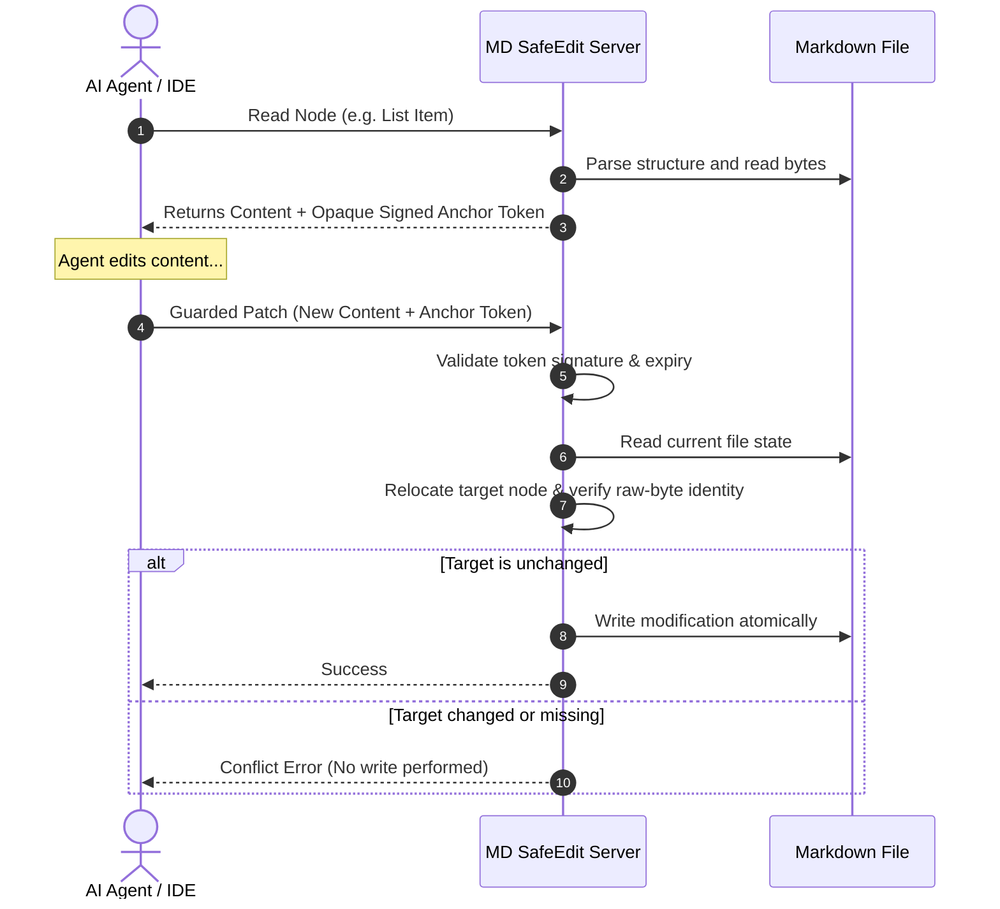

# MD SafeEdit

> **Safe, precise, structure-aware Markdown editing for AI coding agents.**

MD SafeEdit provides a reference implementation of a **Markdown-aware guarded patch protocol** for AI agents. It protects files from silent overwrites, handles content relocation when surrounding lines move, and ensures byte-for-byte fidelity of untouched parts.

---

## 🚀 Quick Start (MCP & CLI)

You do **not** need to clone this repository to use MD SafeEdit. You can install or run it directly via NPM.

### A. Run as an MCP Server (Cursor & Claude Desktop)
MD SafeEdit implements the Model Context Protocol (MCP), allowing AI coding assistants to automatically inspect, search, and safely update Markdown files using guarded patches.

#### 1. Claude Desktop
Add the following to your Claude Desktop configuration file (typically `~/Library/Application Support/Claude/claude_desktop_config.json` on macOS, or `%APPDATA%\Claude\claude_desktop_config.json` on Windows):

```json
{
  "mcpServers": {
    "md-safeedit": {
      "command": "npx",
      "args": [
        "-y",
        "@md-safeedit/mcp@dev"
      ],
      "env": {
        "MDSE_ALLOWED_ROOTS": "/absolute/path/to/your/workspace"
      }
    }
  }
}
```

> [!IMPORTANT]
> - Replace `/absolute/path/to/your/workspace` with your actual workspace root directory.
> - For security, the MCP server restricts files it can read or write to directories specified in `MDSE_ALLOWED_ROOTS` (see Configuration below).

#### 2. Cursor
1. Go to **Settings** -> **Features** -> **MCP**.
2. Click **+ Add New MCP Server**.
3. Set the following details:
   - **Name**: `md-safeedit`
   - **Type**: `stdio`
   - **Command**: `npx -y @md-safeedit/mcp@dev`
4. *(Optional)* Add the `MDSE_ALLOWED_ROOTS` environment variable in Cursor's settings. By default, it will allow operations in Cursor's current working directory.

---

### B. Use via Command Line (CLI)
You can install the command-line utility globally to manually inspect files and run operations:

```bash
# Install CLI globally
npm install -g @md-safeedit/cli@dev

# Inspect file outline, line endings, size, and current revision hash
mdse inspect document.md

# Search for sections, list items, or tables containing a query
mdse search document.md --query "Installation"

# Read a specific node and obtain an opaque anchor token
mdse read document.md --node-id "section:Getting Started"
```

> [!NOTE]
> During the developer preview phase, the packages are published to NPM with the `@dev` tag. When installing or running via NPM/npx, make sure to append `@dev`.

---

## 💡 How It Works & Example

Traditional editing tools (e.g., regex replacement, unified diffs, full-file rewrites) often suffer from **ambiguity** (duplicate text in a file) or **stale writes** (writing to a file that has changed since the agent last read it). 

MD SafeEdit uses a **Compare-and-Swap (CAS) signature-guarded protocol**:



### Protocol Example

1. **Agent reads a node** (e.g., a table row):
   ```json
   {
     "content": "| Charging current | 1A |",
     "anchor": {
       "token": "mdse_a1_..."
     }
   }
   ```
2. **Agent requests a guarded patch**:
   ```json
   {
     "operations": [
       {
         "op": "replace",
         "anchor_token": "mdse_a1_...",
         "content": "| Charging current | 2A |"
       }
     ]
   }
   ```
3. **MD SafeEdit applies the patch**:
   - Verify that the target node is unmodified (raw-byte identity).
   - Relocate the node if surrounding lines changed but the target itself is unchanged.
   - Refuse the write with a descriptive error code (e.g. `TARGET_CHANGED`) if anyone else changed the target.

---

## ⚖️ Benchmark Results

We programmatically evaluated the core protocol against 4 common baseline strategies across **200 distinct test tasks**:

| Editing Strategy | Safe Edit Success Rate (SESR) | False Accept Rate (FAR) | Key Limitations |
| :--- | :---: | :---: | :--- |
| **B1 (Full-File Rewrite)** | 35.7% | **100.0%** | Overwrites concurrent human or agent edits silently. |
| **B2 (Exact String Replace)** | 60.0% | 0.0% | Fails completely on duplicate strings (ambiguity). |
| **B3 (Unified Diff)** | 52.6% | **33.3%** | Prone to fuzzy-matching corruption in similar sections. |
| **B4 (Line-Hash Patch)** | 71.4% | 0.0% | Fails on shifted offsets if lines before/after are added. |
| **B5 (MD SafeEdit)** | **100.0%** | **0.0%** | **Guarantees zero silent overwrites and 100% correct edits.** |

See the complete [Benchmark Report](packages/benchmark/REPORT.md) for details.

---

## ⚙️ Configuration (Environment Variables)

Customize the behavior of the MCP server or CLI using the following environment variables:

| Variable | Default | Description |
| :--- | :--- | :--- |
| `MDSE_ALLOWED_ROOTS` | `process.cwd()` | Comma-separated list of absolute paths. Prevents directory traversal attacks; the server will reject reads or writes outside these directories. |
| `MDSE_TOKEN_TTL_MS` | `3600000` (1 hour) | Lifetime of signed anchor tokens in milliseconds. Prevents agents from using stale tokens from hours or days ago. |

---

## 🛠️ Contributor & Developer Guide

If you want to modify the source code, build locally, run tests, or execute the benchmarks:

### Prerequisites
- Node.js LTS
- npm

### 1. Clone & Build
```bash
git clone https://github.com/Igloo302/md-safeedit.git
cd md-safeedit
npm install
npm run build --workspaces
```

### 2. Run Tests
```bash
npm run test
```

### 3. Run the Benchmark Suite
```bash
# Generate the 200 tasks
node packages/benchmark/dist/generate-tasks.js

# Execute the runner and output comparison
node packages/benchmark/dist/run.js
```

---

## 📦 Monorepo Packages

MD SafeEdit enforces strict package boundaries:

* [`packages/core`](packages/core): Guarded patch engine (revisions, CAS planning, atomic CAS writer, overlap detection). **No Markdown dependency.**
* [`packages/markdown`](packages/markdown): Markdown structural adapter (parsing, outline, relocation, dialect validation).
* [`packages/protocol`](packages/protocol): Public request/response schemas and HMAC-signed anchor tokens.
* [`packages/cli`](packages/cli): Command Line Interface (JSON-RPC adapter).
* [`packages/mcp`](packages/mcp): Model Context Protocol (MCP) server for stdio.
* [`packages/benchmark`](packages/benchmark): Benchmarking suite and baseline implementations.

---

## 🛡️ Safety Invariants & Scope

### Safety Invariants
- A write operation must not accept a bare node ID; it **must** carry an opaque anchor token.
- Normalized hashes are used for ranking, but only **raw-byte identity** authorizes automatic relocation.
- Any intersecting mutation ranges in one transaction reject the entire transaction.
- Validation and disk-state verification happen again immediately before commit.
- Untouched byte ranges remain byte-for-byte identical (no line ending normalization).

### Supported Structures (Phase 1)
- Document, ATX and Setext headings, logical sections.
- Paragraphs, list items, fenced code blocks, GFM tables and table rows.
- YAML frontmatter as a raw top-level block.

---

## 📄 License

Licensed under the Apache License, Version 2.0. See [LICENSE](LICENSE) for details.
